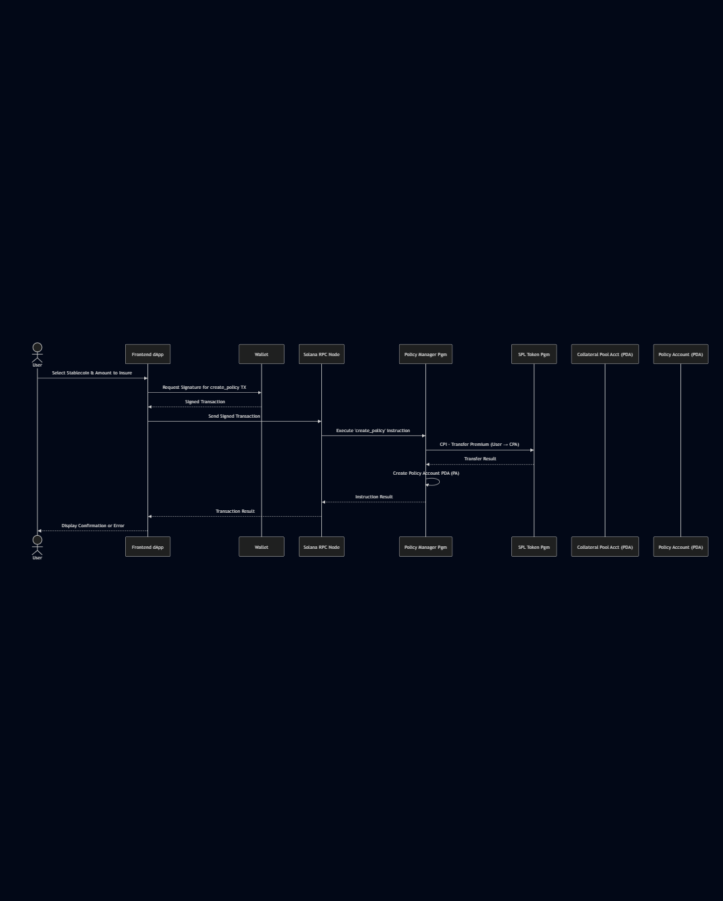

# StableGuard 

## 1. Protocol MVP Requirements:

* The protocol shall allow a user (Buyer) to purchase fixed-term (7-day) insurance policies for USDT (on Solana).
* The protocol shall allow a user (Buyer) to purchase fixed-term (7-day) insurance policies for USDC (on Solana).
* The protocol shall use the Pyth Network price feed to determine the stablecoin price at policy expiry.
* The protocol shall define a depeg event as the relevant Pyth price feed being below $0.985 at the exact policy expiry timestamp.
* The protocol shall automatically pay out a fixed percentage (e.g., 10% binary) of the insured nominal value in USDC if a depeg event is triggered at expiry.
* The protocol shall allow users (Underwriters/LPs) to deposit USDC collateral into a shared pool to back insurance policies.
* The protocol shall collect premiums (in USDC) from Buyers upon policy purchase.
* The protocol shall distribute collected premiums to Underwriters proportionally to their share of the collateral pool (mechanism details TBD in implementation, may be via withdrawal).
* The protocol shall allow Underwriters to withdraw their deposited USDC collateral and accrued earnings, subject to defined conditions (e.g., lockups, pool health).

## 2. High-Level Architecture Diagram (MVP):

This diagram shows the primary components, their interactions, and key account types.

  
Click to view diagram

  

## 3. Explanation of Architecture Components:

* **User Interaction Layer:**
    * **User (Buyer/Underwriter):** Initiates actions like buying policies or depositing/withdrawing collateral.
    * **Frontend dApp:** The web interface (React/Next.js) the user interacts with. It displays information, constructs transactions, and communicates with the wallet and RPC node.
    * **Wallet Extension:** Securely stores the user's private keys and prompts the user to sign transactions initiated by the dApp.
    * **Solana RPC Node:** The gateway for the frontend to send transactions to the Solana network and read account data from the blockchain.
* **Solana On-Chain Layer:**
    * **Policy Manager Program (Anchor/Rust):** Handles the logic for creating and managing insurance policies. It defines the structure of `Policy Accounts` and initiates the premium transfer CPI.
    * **Collateral Pool Program (Anchor/Rust):** Manages the pool of USDC collateral provided by underwriters. It handles deposits and withdrawals. It contains the critical logic for checking policy expiry, reading the Pyth oracle price, evaluating the depeg trigger, calculating the binary payout, and initiating payout/withdrawal CPIs.
    * **SPL Token Program (Solana Native):** The standard Solana program used for all USDC token transfers (premiums, collateral deposits, payouts, withdrawals). The StableGuard programs interact with it via Cross-Program Invocations (CPIs).
    * **Policy Accounts (PDAs):** Program Derived Addresses controlled by the Policy Manager. Each PDA stores the state of a single insurance policy (insured amount, expiry, buyer, status, etc.). *See Account Structures below.*
    * **Collateral Pool Token Account (PDA):** An SPL Token Account controlled by the Collateral Pool Program. This PDA holds the aggregated USDC collateral deposited by all underwriters. *Its structure is defined by the SPL Token Program, but its authority is the Collateral Pool Program PDA.*
    * **User's USDC Wallet Account:** The standard token account owned by the user in their wallet.
* **External Dependencies Layer:**
    * **Pyth Network Oracle:** An essential external data source providing real-time price feeds (USDT/USD, USDC/USD) directly on the Solana blockchain. The Collateral Pool Program reads this data to determine if a depeg trigger condition is met.

## 4. Account Structures (Class Diagram):

This diagram shows the data fields within the primary custom account type defined by the StableGuard protocol.

  
Click to view diagram

  

* **PolicyAccount (PDA):** Stores the state for each individual insurance policy. Includes who bought it, what's insured, the amount, term, status, etc.
* **(Implicit) Collateral Pool Token Account (PDA):** Holds the USDC collateral. Its structure (`mint`, `owner`, `amount`, etc.) is standard SPL Token Account format. The key aspect is that its `owner` (authority) is a PDA derived from the Collateral Pool Program.

## 5. Sequence Diagrams (MVP Flows):

These diagrams show the order of interactions between components for key flows.

* **5.1. Buy Policy Sequence:**

    

    
Click to view diagram

    

    

* **5.2. Expiry Check & Payout Sequence:**

    

    
Click to view diagram

    

    

## 6. Detailed MVP Flowcharts:

These flowcharts illustrate the step-by-step process logic within the smart contracts for the core user actions in the MVP.

* **6.1. Buy Insurance Policy Flow:**

    

    
Click to view diagram

    

    

* **6.2. Deposit Collateral Flow:**
    *(User Story: SGI-LP-001b)*

   

    
Click to view diagram

    

    

* **6.3. Expiry Check & Payout Flow:**

    

    
Click to view diagram

    

    

* **6.4. Withdraw Collateral Flow:**

    

    
Click to view diagram

    

    
